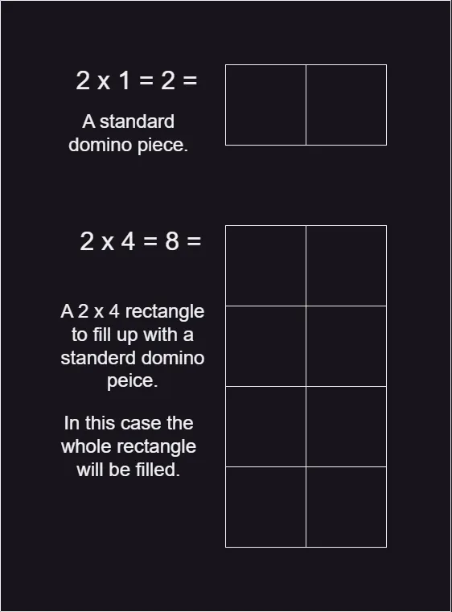
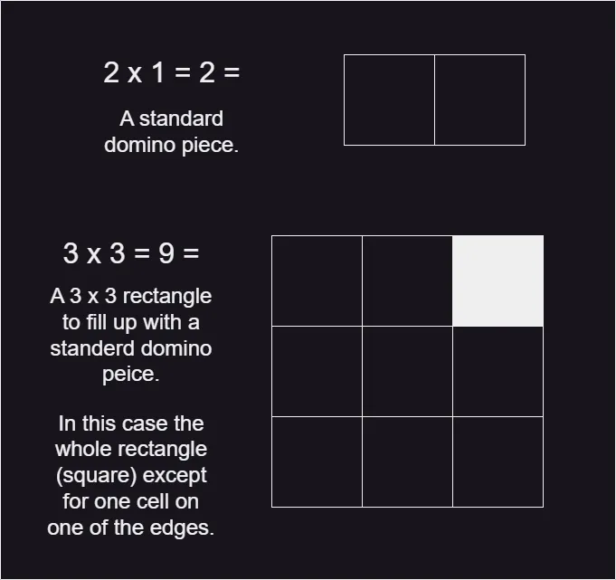

# A. Domino piling on codeforces

You are given a rectangular board of M × N squares. Also you are given an unlimited number of standard domino pieces of 2 × 1 squares. You are allowed to rotate the pieces. You are asked to place as many dominoes as possible on the board so as to meet the following conditions:

1. Each domino completely covers two squares.
2. No two dominoes overlap.
3. Each domino lies entirely inside the board. It is allowed to touch the edges of the board.

Find the maximum number of dominoes, which can be placed under these restrictions.

### Input

In a single line you are given two integers M and N — board sizes in squares (1 ≤ M ≤ N ≤ 16).

### Output

Output one number — the maximal number of dominoes, which can be placed.

### Algorithm

1. Input:
    - Read two integer values, m and n, from the user.
2. Calculation:
    - Calculate the product of m and n and store it in the product variable.
    - Calculate the remainder of the product when divided by 2 and store it in the reminder variable.
    - Subtract the reminder from the product and divide the result by 2. Store the final result in the result variable.
3. Output:
    - Print the calculated result to the console.

### Representation

