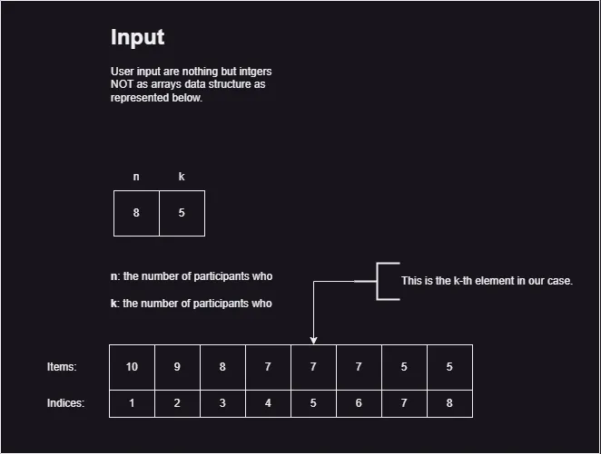

# A. Next Round

### Input

The first line of the input contains two integers n and k (1 <= k <= n <= 50) separated by a single space.

The second line contains n space-separated integers _a1_, _a2_, ..., _an_ where (0 <= ai <= 100) and ai is the score earned by the participant who got the _i-th_ place.

### Output

the number of participants who advance to the next round.

### Algorithm

1. Start
2. Read `n` and `k`
3. If `n` < `k` then
    - Print "The number of participants cannot be less than the number of rounds"
    - Stop
6. Else
7. Allocate memory for an array participants of size `n`
8. Read scores of `n` participants into the `participants` array
9. Find the `k-1th` largest score in the `participants` array and store it in threshold
10. Initialize `advancers` to 0
11. For each participant's score:
12. If the score is greater than or equal to the threshold and is positive, increment advancers
13. Print the value of `advancers`
14. Deallocate memory for the `participants` array
15. Stop

