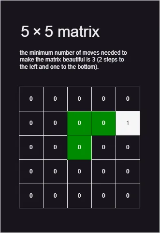

# A. Beautiful Matrix on codeforces

You've got a 5x5 matrix, consisting of 24 zeroes and a single number one. Let's index the matrix rows by numbers from 1 to 5 from top to bottom, let's index the matrix columns by numbers from 1 to 5 from left to right. In one move, you are allowed to apply one of the two following transformations to the matrix:

Swap two neighboring matrix rows, that is, rows with indexes i and i + 1 for some integer i (1 <= i < 5).
Swap two neighboring matrix columns, that is, columns with indexes j and j + 1 for some integer j (1 <= j < 5).
You think that a matrix looks beautiful, if the single number one of the matrix is located in its middle (in the cell that is on the intersection of the third row and the third column). Count the minimum number of moves needed to make the matrix beautiful.

### Input

The input consists of five lines, each line contains five integers: the j-th integer in the i-th line of the input represents the element of the matrix that is located on the intersection of the i-th row and the j-th column. It is guaranteed that the matrix consists of 24 zeroes and a single number one.

### Output

Print a single integer — the minimum number of moves needed to make the matrix beautiful.

### Algorithm

1. **Initialize:**
    - Create a 5x5 matrix.
2. **Input:**
    - Read 25 numbers into the matrix.
3. **Search:**
    - Find the position of the number 1 in the matrix.
4. **Calculate Distance:**
    - Calculate the distance between the found position and the center (3, 3).
5. **Output:**
    - Print the calculated distance.

### Representation

